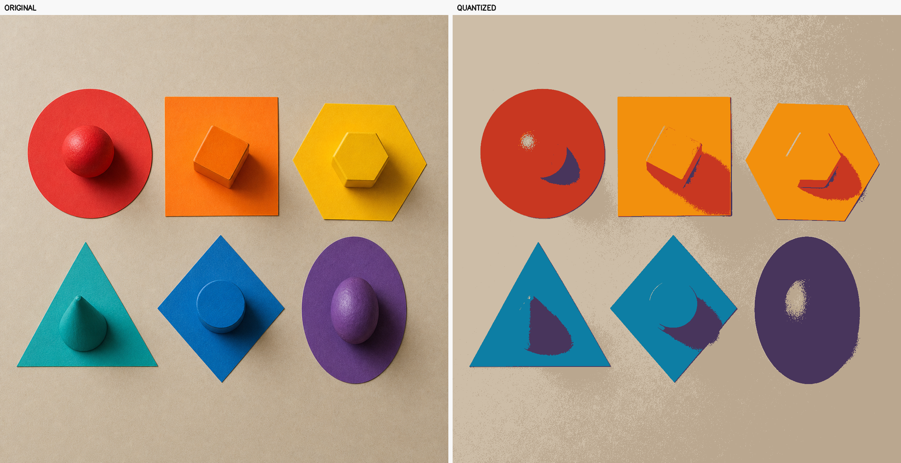
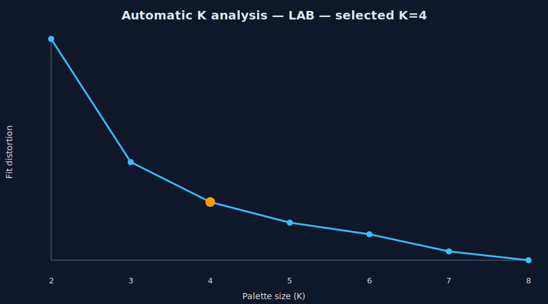

# K-Means Color Studio

[](https://github.com/SabahattinAkal/kmeans-color-studio/actions/workflows/ci.yml)


[](LICENSE)

**Erasmus AI Rebuild Series — Original 2022, rebuilt 2026**

This repository is a ground-up 2026 rebuild of an early exercise created during my high-school Erasmus program in 2022. The untouched implementation is preserved in the `archive/erasmus-2022` branch and the `erasmus-2022-original` tag.

K-Means Color Studio turns a photograph into a smaller, reproducible color palette. It includes deterministic OpenCV K-Means, bounded-memory processing for large images, dominant color extraction, PNG comparisons, JSON/CSS palette export, a CLI, a browser demo, tests, Docker, and CI.

## Visual demo



The bundled demo was produced by the repository itself:

```powershell
kmeans-color-studio assets\demo\color-still-life-input.png `
  --colors 6 `
  --output output\portfolio-demo
```

| Verified result | Value |
|---|---:|
| Pixels processed | 1,572,516 |
| Requested palette | 6 colors |
| Reconstruction MSE | 895.9704 |
| Local CPU runtime | 0.2591 s |

The six exported colors are `#CDBDA7`, `#BAA78F`, `#F2900D`, `#C83721`, `#48355C`, and `#0D7EA4`. Inspect the committed [JSON palette](assets/demo/palette-k6.json), [CSS variables](assets/demo/palette-k6.css), [input](assets/demo/color-still-life-input.png), or [quantized output](assets/demo/quantized-k6.png).

> The colorful still-life input is an original AI-generated generic test fixture. The palette, metrics, and processed images above are real outputs produced by this code with seed `42`.

## Advanced: perceptual color and automatic K

RGB distance is convenient but does not closely follow human color perception. Version 1.1 can cluster in OpenCV's CIELAB representation and test a bounded range of palette sizes. The selected elbow is the candidate with the maximum distance from the endpoint line of the normalized log-distortion curve.



```powershell
kmeans-color-studio assets\demo\color-still-life-input.png `
  --colors auto `
  --min-colors 2 `
  --max-colors 8 `
  --color-space lab `
  --output output\advanced-demo
```

The committed run selected `K=4`, produced an RGB reconstruction MSE of `760.8320`, and wrote [the complete candidate report](assets/demo/cluster-analysis-lab.json), [the perceptual comparison](assets/demo/comparison-lab-auto.png), and [the selected palette](assets/demo/palette-lab-auto.json). Automatic selection is a reproducible heuristic, not a universal aesthetic decision; designers can still choose `K` explicitly.

## 2022 → 2026

| Original exercise | Rebuilt project |
|---|---|
| Hard-coded missing `neon.png` | Any common image format via CLI or upload |
| Fixed `K=3` | Selectable 2–32 color palette |
| Random output | Seeded, reproducible K-Means++ |
| Screen-only result | PNG comparison + JSON and CSS exports |
| No validation or tests | Input validation, unit tests and CI |
| One script | Installable package, web API and Docker image |

## Quick start

```powershell
python -m venv .venv
.venv\Scripts\Activate.ps1
pip install -e .
kmeans-color-studio path\to\photo.jpg --colors 5 --output output
```

Generated files:

- `quantized.png`
- `comparison.png`
- `palette.json`
- `palette.css`

You can run the command immediately with the committed demo input; no external image download is required.

Run the web demo:

```powershell
pip install -e ".[web]"
uvicorn app.main:app --reload
```

Then open `http://127.0.0.1:8000`. API documentation is available at `/docs`.

## Docker and tests

```powershell
docker build -t kmeans-color-studio .
docker run --rm -p 8000:8000 kmeans-color-studio
python -m unittest discover -s tests -v
```

## How it works

1. Convert each RGB pixel into a three-dimensional data point.
2. Fit seeded K-Means++ centers on all pixels or a bounded sample.
3. Assign every pixel to the nearest center in memory-safe chunks.
4. Sort centers by pixel frequency and rebuild the image.
5. Export the palette as HEX/RGB, JSON, and CSS custom properties.

The reported mean squared error measures color reconstruction loss; lower is closer to the original. K-Means is a perceptual simplification, not a semantic segmentation algorithm.

## Project map

```text
src/kmeans_color_studio/
├── core.py          # validation, sampling, K-Means, palette/export helpers
├── analysis.py      # automatic K analysis and SVG/JSON reports
├── cli.py           # command-line interface
└── __main__.py      # python -m entry point
app/main.py          # FastAPI upload demo
tests/test_core.py   # deterministic unit tests
assets/demo/         # committed input, output, palette, and comparison
```

Large images are fitted on at most `--max-samples` pixels, but every source pixel is reassigned to the nearest learned center in bounded chunks. This keeps the result complete without allocating an unbounded pixel-by-cluster distance matrix.

Public API users can call `quantize_image(..., color_space="lab")` or `analyze_cluster_range(...)` directly. CLI and API defaults remain RGB for backwards compatibility.

## Türkçe

Bu depo, 2022 yılında lise Erasmus programı sırasında geliştirdiğim erken dönem K-Means çalışmasının 2026'da sıfırdan hazırlanmış modern sürümüdür. Orijinal kod `archive/erasmus-2022` dalında ve `erasmus-2022-original` etiketinde korunur.

Uygulama bir fotoğrafı seçilen sayıda baskın renge indirger; sonucu karşılaştırma görseli, JSON ve CSS olarak dışa aktarır. Büyük görsellerde eğitim için kontrollü piksel örneklemesi yapar, fakat çıktı oluştururken bütün pikselleri işler. Sabit seed sayesinde aynı girdide aynı palet tekrar üretilebilir.

## Limitations

- RGB Euclidean distance is not perfectly aligned with human color perception.
- Very small palette sizes intentionally remove fine texture and gradients.
- The web endpoint accepts files up to 20 MB and does not persist uploads.

## Open-source use

Released under the [MIT License](LICENSE). See [CONTRIBUTING.md](CONTRIBUTING.md), [SECURITY.md](SECURITY.md), and [CHANGELOG.md](CHANGELOG.md) before deployment or contribution.
